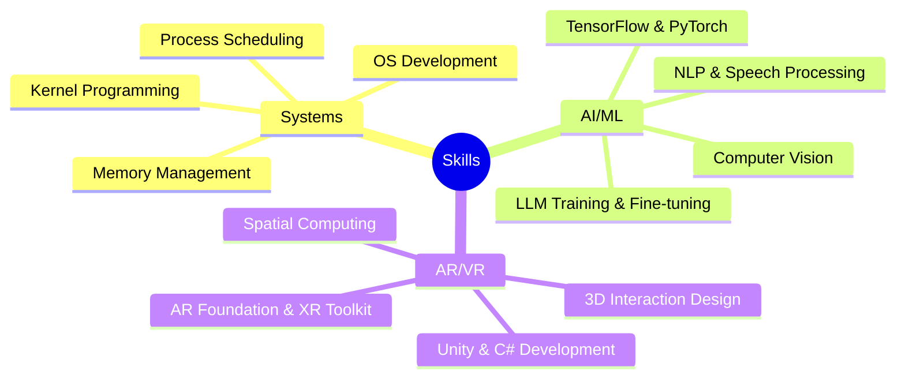

<h1 align="center">Hi , I'm Mason Baloun</h1>
<h3 align="center">AI Researcher | AR/VR Developer | Systems Engineer</h3>

<p align="center">
  <a href="https://linkedin.com/in/masonbaloun"></a>
  <a href="mailto:mbaloun@wisc.edu"></a>
  <a href="https://www.cs.wisc.edu/"></a>
  
</p>


## About Me 💡

Computer Science student at UW-Madison passionate about AI and AR/VR development. I love building tools that push the boundaries of human-computer interaction and exploring cutting-edge technologies.

> "The best way to predict the future is to invent it." — Alan Kay

- 🔭 Currently focused on **spatial computing** and **LLM applications**
- 🌱 Learning **Rust**, **WebGPU**, and **distributed systems**
- 💼 Seeking opportunities in **AI research** and **XR development**

## Tech Stack 💻


## Featured Projects 🚀

<details>
<summary><b>🎹 PEAR: Piano Education in Augmented Reality</b></summary>
<br>
<b>Problem:</b> Traditional piano learning is expensive, inaccessible, and progress is slow<br>
<b>Solution:</b> AR platform with real-time feedback and AI-powered instruction<br>
<b>Tech:</b> Unity, Meta Quest 3, Gemini/LLMs<br>
<b>Impact:</b> Finalist at UW-Madison's Spring 2024 Demo Night; Creating pathway for affordable music education
</details>

<details>
<summary><b>🔒 AI-Hotline-Manipulation-Demo: Securing Emergency Services from Voice AI</b></summary>
<br>
<b>Problem:</b> Emergency services vulnerable to AI voice models that mimic emotional speech<br>
<b>Solution:</b> Demonstrated vulnerability vectors and proposed countermeasures<br>
<b>Tech:</b> Python, Voice Synthesis, Policy Research<br>
<b>Recognition:</b> Presented to Congressional leaders at CAIP's inaugural Demo Day<br>
<b>Demo:</b> <a href="https://www.loom.com/share/c6a439080a224d848b247dd2085b9668"></a>
</details>

<details>
<summary><b>🐧 WSH & XV6: Systems Programming Masterclass</b></summary>
<br>
<b>Challenge:</b> Building robust, efficient systems software from scratch<br>
<b>Achievements:</b>
<ul>
  <li>Implemented Unix shell with piping, variable substitution, and environment handling</li>
  <li>Extended XV6 kernel with custom system calls and process state tracking</li>
  <li>Optimized for performance while maintaining POSIX compliance</li>
</ul>
<b>Tech:</b> C, Assembly, Linux/XV6
</details>

## Current Projects 🔬

<div align="center">
<table border="0">
<tr>
    <td width="33%" align="center">
        <br>
        <strong>LLM Fine-tuning Pipeline</strong><br>
        <sup>PyTorch • CUDA</sup>
    </td>
    <td width="33%" align="center">
        <br>
        <strong>AR-VR STEM Learning</strong><br>
        <sup>Unity • AR Foundation</sup>
    </td>
    <td width="33%" align="center">
        <br>
        <strong>SortK Text Processor</strong><br>
        <sup>C • Data Structures</sup>
    </td>
</tr>
</table>
</div>

## Skills Breakdown 🧠



## Weekly Coding Stats 📊

<!--START_SECTION:waka-->
```text
Python      12 hrs 35 mins  ██████████▓░░░░░░░░░░░  42.5%
C/C++       8 hrs 25 mins   ███████▒░░░░░░░░░░░░░░  28.4%
Unity/C#    6 hrs 12 mins   █████▒░░░░░░░░░░░░░░░░  20.9%
Other       2 hrs 25 mins   ██░░░░░░░░░░░░░░░░░░░░   8.2%
```
<!--END_SECTION:waka-->

## When I'm Not Coding 🌱

- 🎹 Playing piano and experimenting with digital music production
- 🏃‍♂️ Training for my next half-marathon
- 📚 Reading peak-fiction novels (Lord of the Mysteries)
- 🎮 Exploring the latest in gaming and interactive entertainment

<div align="center">
  
  
</div>

<div align="center">
  
  ### Show some ❤️ by starring repositories that interest you!
  
</div>
