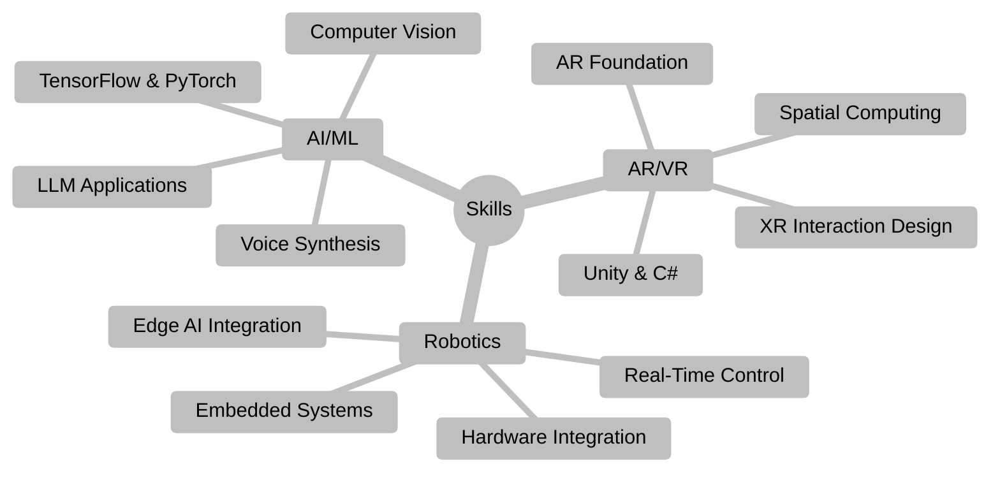

<h1 align="center">Hi , I'm Mason Baloun</h1>
<h3 align="center">AI Engineer | AR/VR Developer | Robotic Integration</h3>

  

  
  
  
  

## Portfolio Highlights

  
  
<b>⬆️ Click the image to view my interactive portfolio slideshow ⬆️</b>

## About Me

Computer Science student at UW-Madison building practical AI/ML applications, immersive AR/VR experiences, and end-to-end robotics systems. Google Hackathon winner and Capitol Hill presenter on AI security.

> "The best way to predict the future is to invent it." — Alan Kay

- 🔭 Currently focused on **AI engineering** and **spatial computing**
- 🌱 Learning **Unity**, **edge AI**, and **real-time control systems**
- 💼 Seeking opportunities in **AI/ML engineering** and **AR/XR development**

## Tech Stack

## Featured Projects

<b>Beyond Words - 1st Place Google AI Hackathon</b>

 
<b>Problem:</b> Traditional language learning is slow and expensive 
<b>Solution:</b> Gamified AI language learning platform with strategic card mechanics 
<b>Tech:</b> Next.js, React, Gemini API, AI Voice Synthesis 
<b>Impact:</b> Production-ready AI pipeline validated by Google engineers 
<b>Demo:</b> 

<b>PEAR: Piano Education in Augmented Reality</b>

 
<b>Problem:</b> Piano instruction is expensive and inaccessible 
<b>Solution:</b> AR platform with real-time feedback and AI-powered instruction 
<b>Tech:</b> Unity, Meta Quest 3, Gemini/LLMs 
<b>Impact:</b> UW-Madison Spring 2024 Tech Exploration Lab Demo (Sponsored by Google) 
<b>Demo:</b> 

<b>Rover XR - AR Mars Exploration Simulator</b>

 
<b>Challenge:</b> Building immersive educational experiences for space exploration 
<b>Solution:</b> Mobile AR app with real-time terrain scanning and rover simulation 
<b>Tech:</b> Unity, AR Foundation, Google Gemini 
<b>Recognition:</b> UW-Madison CS Capstone Project 
<b>Demo:</b> 

<b>AI Security Research - Capitol Hill Presentation</b>

 
<b>Problem:</b> Emergency services vulnerable to AI-generated voice manipulation 
<b>Solution:</b> Demonstrated vulnerability vectors and proposed countermeasures 
<b>Tech:</b> Python, Voice Synthesis, Multi-Agent LLM Systems 
<b>Recognition:</b> Presented to Congressional leaders and Rep. Bill Foster at Center for AI Policy Advanced AI Expo 
<b>Impact:</b> Met with Congressional staffers and OpenAI researcher Scott Aaronson

## Current Focus

<table border="0">
<tr>
    <td width="33%" align="center">
         
        <strong>AI Engineering</strong> 
        LLM Applications • ML Pipelines
    </td>
    <td width="33%" align="center">
         
        <strong>AR/VR Development</strong> 
        Unity • Spatial Computing
    </td>
    <td width="33%" align="center">
         
        <strong>Robotic Integration</strong> 
        Edge AI • Real-Time Control
    </td>
</tr>
</table>

## Skills Breakdown

```mermaid
%%{init: {'theme':'base', 'themeVariables': { 'primaryColor':'#ffffff','primaryTextColor':'#000000','primaryBorderColor':'#64fcd9','lineColor':'#64fcd9','secondaryColor':'#ffffff','tertiaryColor':'#ffffff','mainBkg':'#ffffff','secondaryBkg':'#ffffff','tertiaryBkg':'#ffffff'}}}%%
mindmap
  root((Skills))
    AI/ML
      LLM Applications
      TensorFlow & PyTorch
      Computer Vision
      Voice Synthesis
    AR/VR
      Spatial Computing
      Unity & C#
      AR Foundation
      XR Interaction Design
    Robotics
      Edge AI Integration
      Real-Time Control
      Hardware Integration
      Embedded Systems
```

## GitHub Metrics

  

  
  

  

  
  ### 🌐 Visit [masonbaloun.dev](https://masonbaloun.dev) for my full portfolio
  

