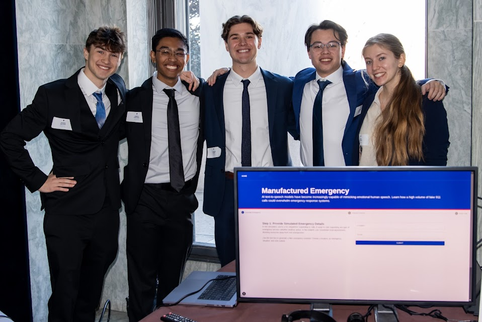
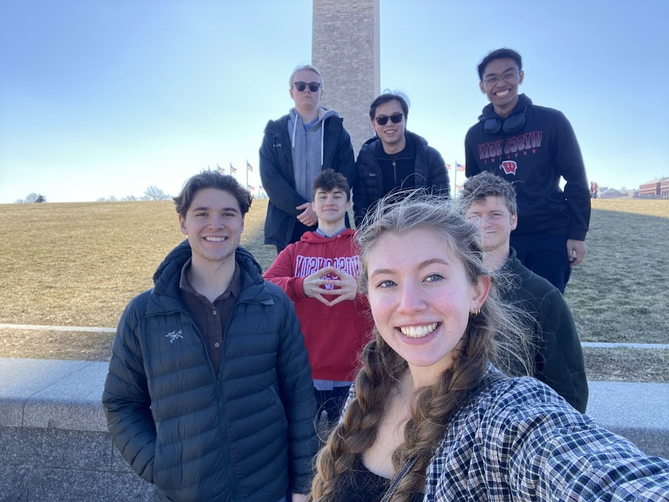
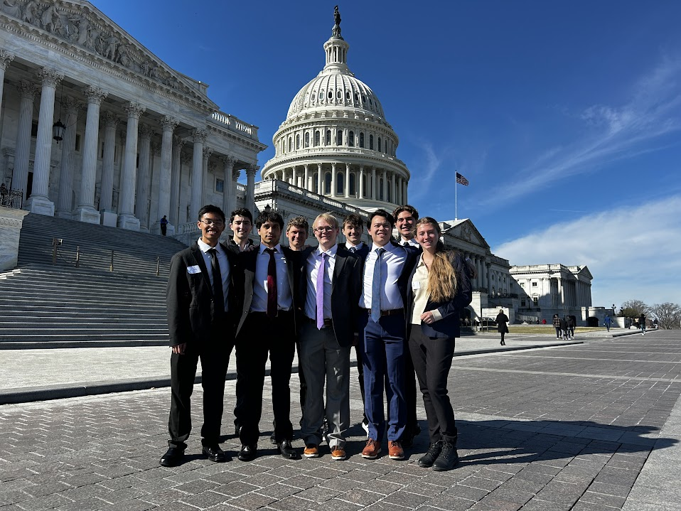
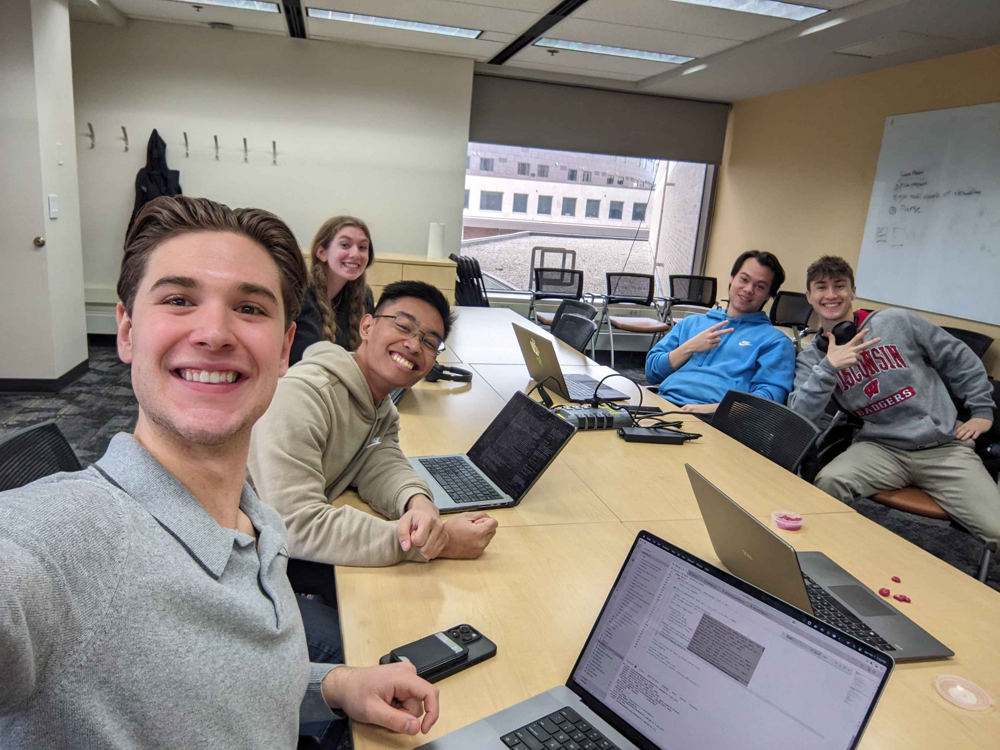
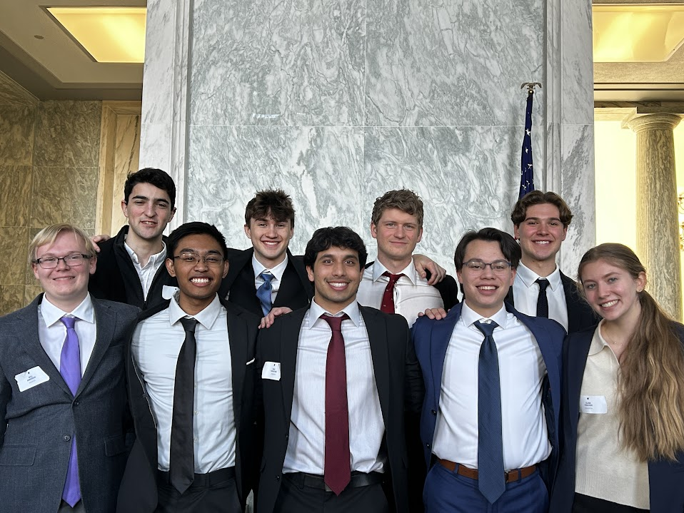
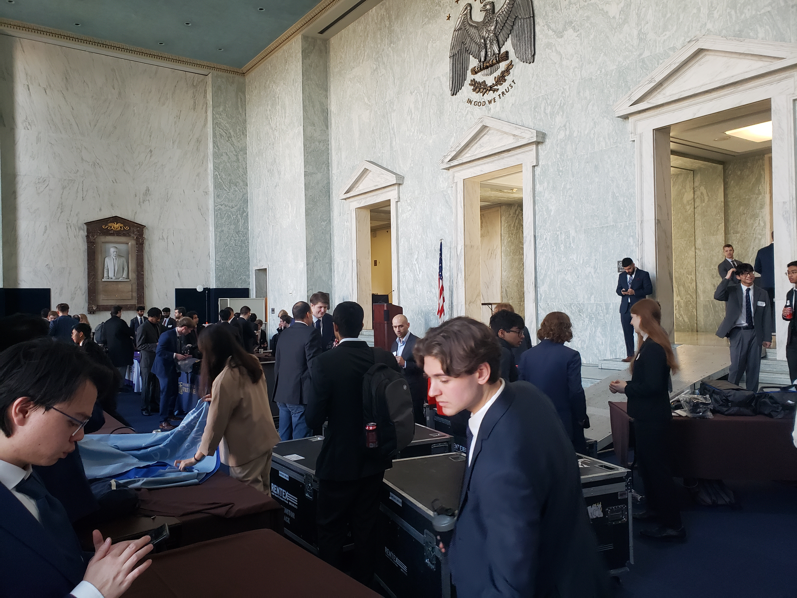
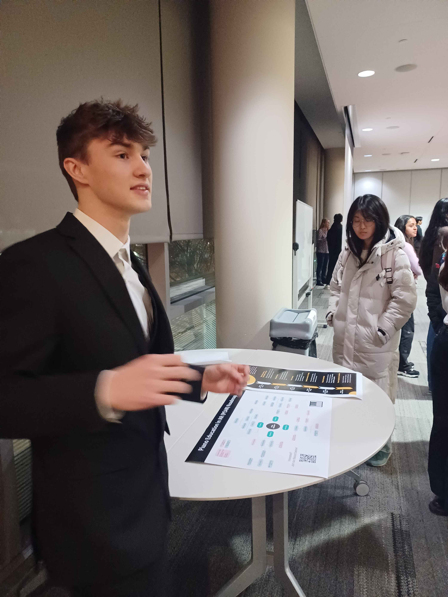
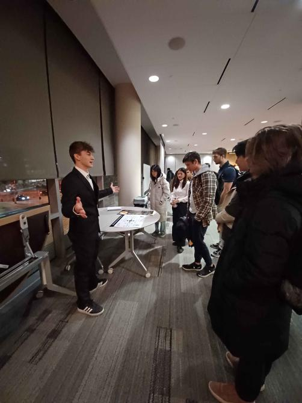

<h1 align="center">Hi , I'm Mason Baloun</h1>
<h3 align="center">AI Researcher | AR/VR Developer | Systems Engineer</h3>

  
  
  
  

<!-- Image Carousel - Replace the existing GIF -->

  

    
<b>Portfolio Highlights 📸</b>

    <table width="400">
      <tr>
        <td align="center">
          
          
<b>WAISI at the Capitol</b>

        </td>
      </tr>
      <tr>
        <td align="center">
          
          
<b>Me at the Capitol</b>

        </td>
      </tr>
      <tr>
        <td align="center">
          
          
<b>AI-Hotline-Manipulation-Demo</b>

        </td>
      </tr>
      <tr>
        <td align="center">
          
          
<b>Programming Session with WAISI</b>

        </td>
      </tr>
      <tr>
        <td align="center">
          
          
<b>WAISI in the House of Representatives</b>

        </td>
      </tr>
      <tr>
        <td align="center">
          
          
<b>CAIP Demo Day</b>

        </td>
      </tr>
      <tr>
        <td align="center">
          
          
<b>WAISI at the Monument</b>

        </td>
      </tr>
      <tr>
        <td align="center">
          
          
<b>PEAR Startup Presentation</b>

        </td>
      </tr>
      <tr>
        <td align="center">
          
          
<b>PEAR Startup Presentation (cont)</b>

        </td>
      </tr>
    </table>
  

## About Me 💡

Computer Science student at UW-Madison passionate about AI and AR/VR development. I love building tools that push the boundaries of human-computer interaction and exploring cutting-edge technologies.

> "The best way to predict the future is to invent it." — Alan Kay

- 🔭 Currently focused on **spatial computing** and **LLM applications**
- 🌱 Learning **Unity** and **Javascript**
- 💼 Seeking opportunities in **AI Integration/Research** and **AR/XR development**

## Tech Stack 💻

## Featured Projects 🚀

<b>🎹 PEAR: Piano Education in Augmented Reality</b>

 
<b>Problem:</b> Traditional piano learning is expensive, inaccessible, and progress is slow 
<b>Solution:</b> AR platform with real-time feedback and AI-powered instruction 
<b>Tech:</b> Unity, Meta Quest 3, Gemini/LLMs 
<b>Impact:</b> UW-Madison's Spring 2024 Tech Exploration Lab Demo (Sponsored by google); Creating pathway for affordable music education

<b>🔒 AI-Hotline-Manipulation-Demo: an AI Safety Awareness Project Presented to Congressional Leaders</b>

 
<b>Problem:</b> Emergency services vulnerable to AI voice models that mimic emotional speech 
<b>Solution:</b> Demonstrated vulnerability vectors and proposed countermeasures 
<b>Tech:</b> Python, Voice Synthesis, Policy Research 
<b>Recognition:</b> Presented to Congressional leaders at CAIP's inaugural Demo Day 
<b>Demo:</b> 

<b>🐧 WSH & XV6: Systems Programming Masterclass</b>

 
<b>Challenge:</b> Building robust, efficient systems software from scratch 
<b>Achievements:</b>
<ul>
  <li>Implemented Unix shell with piping, variable substitution, and environment handling</li>
  <li>Extended XV6 kernel with custom system calls and process state tracking</li>
  <li>Optimized for performance while maintaining POSIX compliance</li>
</ul>
<b>Tech:</b> C, Assembly, Linux/XV6

## Current Projects 🔬

<table border="0">
<tr>
    <td width="33%" align="center">
         
        <strong>PEAR: Piano Education in AR</strong> 
        Unity • Meta Quest • AI
    </td>
    <td width="33%" align="center">
         
        <strong>AR-VR STEM Learning</strong> 
        Unity • AR Foundation
    </td>
    <td width="33%" align="center">
         
        <strong>LLM Fine-tuning Pipeline</strong> 
        PyTorch • CUDA
    </td>
</tr>
</table>

## Skills Breakdown 🧠

## GitHub Metrics ⚡

  

<!-- GitHub Activity Graph -->

## When I'm Not Coding 🌱

- 🎹 Playing piano and experimenting with digital music production
- 🏃‍♂️ Training for my next half-marathon
- 📚 Reading peak-fiction novels (Lord of the Mysteries)
- 🎮 Exploring the latest in gaming and interactive entertainment

  
  

<!-- Dynamic Quote - Updates Daily -->

  

  
  ### Show some ❤️ by starring repositories that interest you!
  

